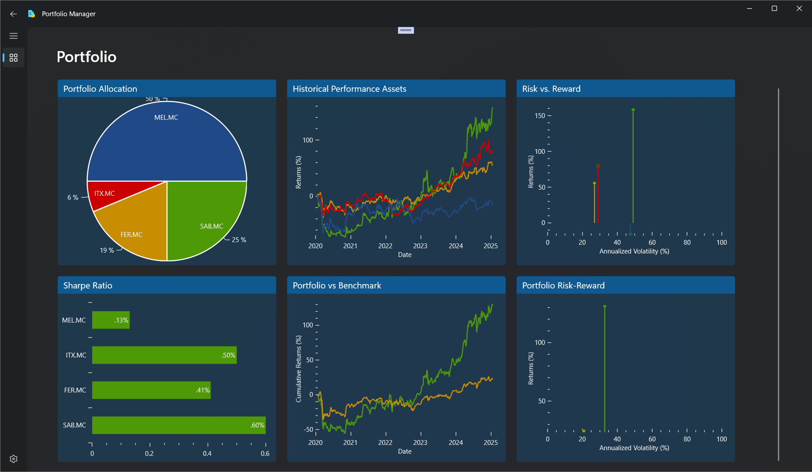
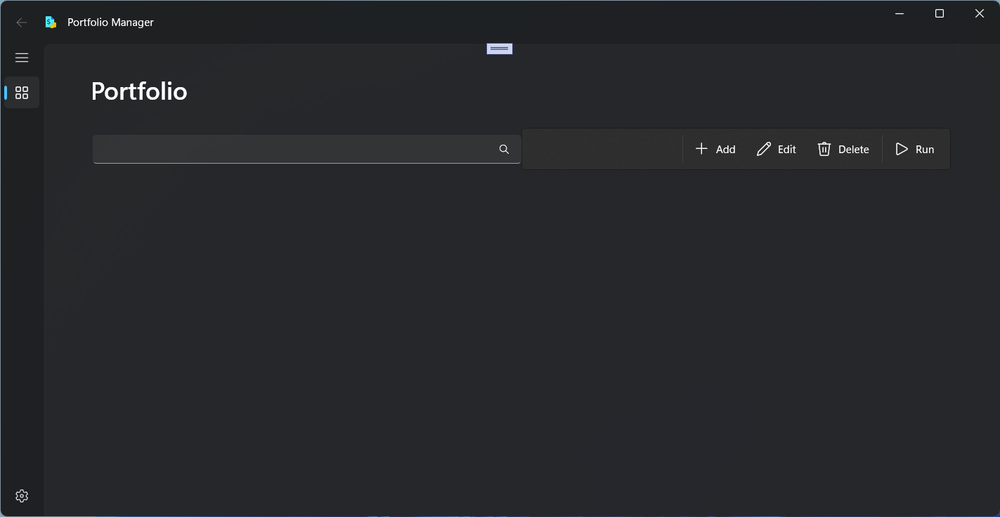
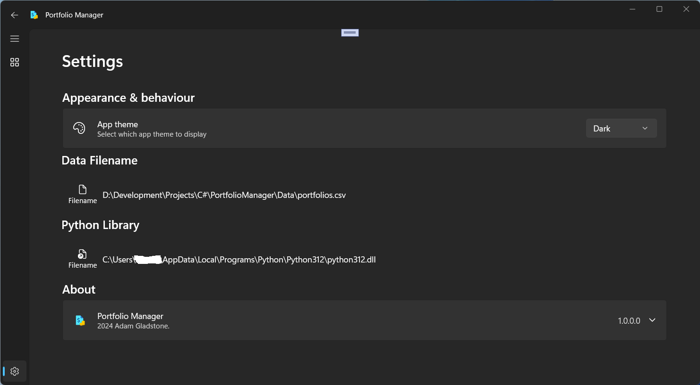
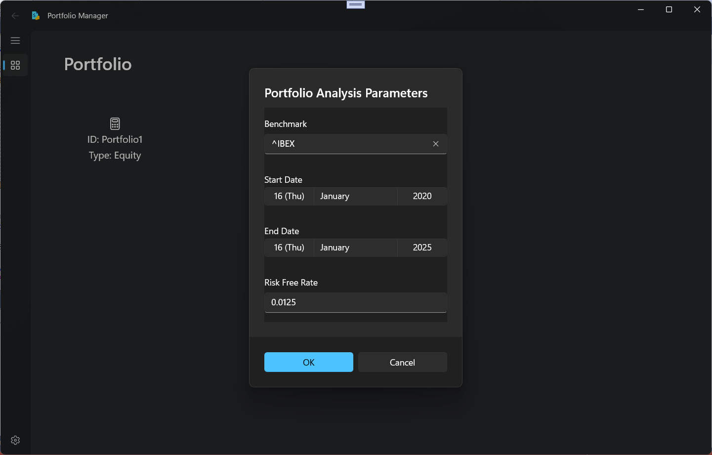

<a name="readme-top"></a>

<!-- PROJECT LOGO -->
<br />
<div align="center">
  <a href="https://github.com/Adam-Gladstone/PortfolioManager">
    
  </a>

  <h3 align="center">PortfolioManager (v1.0)</h3>

  <p align="center">
    <br />
    <a href="https://github.com/Adam-Gladstone/PortfolioManager"><strong>Explore the docs >></strong></a>
    <br />
    <br />
    <a href="https://github.com/Adam-Gladstone/PortfolioManager/issues">Report Bug</a>
    ·
    <a href="https://github.com/Adam-Gladstone/PortfolioManager/issues">Request Feature</a>
  </p>
</div>

<!-- TABLE OF CONTENTS -->
<details>
  <summary>Table of Contents</summary>
  <ol>
    <li>
      <a href="#about-the-project">About The Project</a>
      <ul>
        <li><a href="#built-with">Built With</a></li>
      </ul>
    </li>
    <li>
      <a href="#getting-started">Getting Started</a>
      <ul>
        <li><a href="#prerequisites">Prerequisites</a></li>
        <li><a href="#installation">Installation</a></li>
      </ul>
    </li>
    <li><a href="#usage">Usage</a></li>
    <li><a href="#roadmap">Roadmap</a></li>
    <li><a href="#license">License</a></li>
    <li><a href="#contact">Contact</a></li>
    <li><a href="#acknowledgments">Acknowledgments</a></li>
  </ol>
</details>

<!-- ABOUT THE PROJECT -->
## About The Project
__PortfolioManager__ is a Windows desktop application that allows you to define and analyse a portfolio of (equity) stocks. The analysis is centered on risk and return both within the portfolio and in comparison to a benchmark.

The purpose of the project is to experiment with and demonstrate how to use Python from a C# client in the context of a non-trivial application. 

To do this, we use the Python.NET library (https://pythonnet.github.io/) in a C# (WinUI 3.0) application to execute a Python script. The Python script performs the financial portfolio analysis and returns results for both the portfolio and the benchmark. The interop layer takes the Python results (in terms of Python objects - dictionary, list, tuple etc - and Pandas Series and DataFrame's) and converts these to C# collections that can be used by OxyPlot to visualize the results in a series of graphs.

<a href="https://github.com/Adam-Gladstone/PortfolioManager">
  
</a>

Despite the name __PortfolioManager__, the main interest of the project is not financial portfolio analysis. The main interest is the arrangement of WinUI 3.0 for the UI (using the Community Toolkit and MVVM architecture), sitting on top of Python.NET, which in turn runs the portfolio analysis using a Python script.

__PortfolioManager__ is written in C# (.NET8.0) and uses WinUI and XAML for the user interface.

__PortfolioManager__ demonstrates:
- C#/WinUI and XAML for the UI
- Local file-based database using SQLite
- Community Toolkit features, specifically
    - settings page (with support for light/dark themes)
	- page navigation
	- dependency injection
	- flyout menus
	- a local sqlite database
	- MVVM architecture
- Python.NET - setup and execution of scripts
- OxyPlot graphing: pie chart, line graph, stem graph, bar chart
- Custom exception dialog
- Separate projects for the core (reusable functionality), testing, and user interface.
- (Unit testing using MSTest)

## References
Apart from using the Community Toolkit for WinUI 3.0, we made use of the following resources: 
* Graphing using OxyPlot is based on: https://xamlbrewer.wordpress.com/2022/02/28/drawing-charts-and-diagrams-with-oxyplot-in-winui-3/
* The PythonService uses Python.NET (https://pythonnet.github.io/) to evaluate Python scripts and retrieve data from 'yfinance'.
* The portfolio analysis scripts are based on: https://www.kaggle.com/code/lusfernandotorres/building-an-investment-portfolio-management-app/notebook

<p align="right">(<a href="#readme-top">back to top</a>)</p>

### Built With

* Visual Studio 2022
* C# (.NET8.0)

The following packages are used:
* CommunityToolkit.Mvvm Version="8.3.2"
* CommunityToolkit.WinUI.Controls.Segmented Version="8.1.240916"
* CommunityToolkit.WinUI.Controls.SettingsControls Version="8.1.240916"
* CommunityToolkit.WinUI.UI.Animations Version="7.1.2"
* CommunityToolkit.WinUI.UI.Controls Version="7.1.2"
* CommunityToolkit.WinUI.UI.Controls.DataGrid Version="7.1.2"
* coverlet.collector Version="6.0.2"
* H.OxyPlot.WinUI Version="0.9.30"
* LiveChartsCore.SkiaSharpView.WinUI Version="2.0.0-rc1.2"
* Dapper Version="2.1.35"
* Dapper.Contrib Version="2.0.78"
* Microsoft.Data.Sqlite Version="9.0.0"
* Microsoft.Extensions.Hosting Version="9.0.0"
* Microsoft.NET.Test.Sdk Version="17.12.0"
* Microsoft.WindowsAppSDK Version="1.6.241114003"
* Microsoft.Xaml.Behaviors.WinUI.Managed Version="2.0.9"
* MSTest.TestAdapter Version="3.6.4"
* MSTest.TestFramework Version="3.6.4"
* Newtonsoft.Json Version="13.0.3"
* WinUIEx Version="2.5.0"
* System.Configuration.ConfigurationManager Version="9.0.0"

<p align="right">(<a href="#readme-top">back to top</a>)</p>

<!-- GETTING STARTED -->
## Getting Started
The project can be downloaded from the GitHub repository in the usual way.

The solution consists of four projects:
- PortfolioAnalysisApp: a command line application for testing basic communication with Python.NET
- PortfolioManager: the main WinUI 3.0/C# application
- PortfolioManager.Core: the core services: the database (currently unused) and the Python service
- PortfolioManager.Tests.MSTest: a test project

### Prerequisites

### Installation

<p align="right">(<a href="#readme-top">back to top</a>)</p>

<!-- USAGE EXAMPLES -->
## Usage
Build and start the application for the first time. You will be presented with an empty Portfolio screen. 

<a href="https://github.com/Adam-Gladstone/PortfolioManager">
  
</a>

The first thing to do is setup the application. This means 
1) create/edit the list of portfolios (see below)
2) set the path to the portfolio file
3) set the path to the Python library module (python312.dll)
Also you can choose the theme, or leave the default.

The portfolio is a .csv file (at the moment) with the following structure:

```
PortfolioName	Ticker	Value
Portfolio1	SAB.MC	1000.0
Portfolio1	FER.MC	750.0
Portfolio1	ITX.MC	250.0
Portfolio1	MEL.MC	2000.0
```

Save this file to the application \Data directory and in the settings page set the filename here.
Also set the filename of the python dll. Mine is located at: "C:/Users/.../AppData/Local/Programs/Python/Python312/python312.dll"

<a href="https://github.com/Adam-Gladstone/PortfolioManager">
  
</a>
<p></p>
Return to the main Portfolio page. If everything is correct, the Portfolio page shows the portfolio you have just set up.

Click on the Portfolio. The Portfolio Analysis Params dialog box is shown. Accept the defaults or fill in the benchmark, start and end date for the analysis and risk free rate. Note that you cannot run the analysis without a benchmark or risk free rate. Also note that if the dates are set to non-working days, price data will not be available an an exception will be returned from yfinance.

Press OK. After some moments the Portfolio Details page is displayed with the results of the analysis.
<p></p>
<a href="https://github.com/Adam-Gladstone/PortfolioManager">
  
</a>
<p></p>
<a href="https://github.com/Adam-Gladstone/PortfolioManager">
  
</a>
<p></p>

From here you can go back and perform further analyses or add a new portfolio.

<p align="right">(<a href="#readme-top">back to top</a>)</p>

<!-- ROADMAP -->
## Roadmap

Future directions:

See the [open issues](https://github.com/Adam-Gladstone/PortfolioManager/issues) for a full list of proposed features (and known issues).

<p align="right">(<a href="#readme-top">back to top</a>)</p>

<!-- LICENSE -->
## License

Distributed under the GPL-3.0 License. See `LICENSE.md` for more information.

<p align="right">(<a href="#readme-top">back to top</a>)</p>

<!-- CONTACT -->
## Contact

Adam Gladstone - (https://www.linkedin.com/in/adam-gladstone-b6458b156/)

Project Link: [https://github.com/Adam-Gladstone/PortfolioManager](https://github.com/Adam-Gladstone/PortfolioManager)

<p align="right">(<a href="#readme-top">back to top</a>)</p>

<!-- ACKNOWLEDGMENTS -->
## Acknowledgments

Helpful resources

* [Choose an Open Source License](https://choosealicense.com)
* [GitHub Pages](https://pages.github.com)
* [Font Awesome](https://fontawesome.com)
* [React Icons](https://react-icons.github.io/react-icons/search)

<p align="right">(<a href="#readme-top">back to top</a>)</p>

<!-- PROJECT SHIELDS -->

[![Issues][issues-shield]][issues-url]
[![GPL-3 License][license-shield]][license-url]
[![LinkedIn][linkedin-shield]][linkedin-url]

<!-- MARKDOWN LINKS & IMAGES -->
<!-- https://www.markdownguide.org/basic-syntax/#reference-style-links -->

[issues-shield]: https://img.shields.io/github/issues/Adam-Gladstone/PortfolioManager.svg?style=for-the-badge
[issues-url]: https://github.com/Adam-Gladstone/PortfolioManager/issues

[license-shield]: https://img.shields.io/github/license/Adam-Gladstone/PortfolioManager.svg?style=for-the-badge
[license-url]: https://github.com/Adam-Gladstone/PortfolioManager/LICENSE.md

[linkedin-shield]: https://img.shields.io/badge/-LinkedIn-black.svg?style=for-the-badge&logo=linkedin&colorB=555
[linkedin-url]: https://www.linkedin.com/in/adam-gladstone-b6458b156/
                      
<a name="readme-top"></a>
